<h1>Hi, I'm Abdul Kheeyan 👋</h1>

  <b>Full Stack Developer · AI Enthusiast · Problem Solver</b>

  I build modern digital products, clean user experiences, and practical AI-powered solutions that create real impact.

 

<h3><code>abdul@github ~ $ whoami</code></h3>

<table>
  <tr>
    <td valign="top"></td>
    <td valign="top"></td>
  </tr>
</table>

 

<h3>What I do</h3>

  I work across <b>frontend, backend, product thinking, and AI integration</b> to turn ideas into scalable, user-friendly experiences.

  
  
  
  
  
  
  
  
  
  

 

<table>
  <tr>
    <td>
      
       
      Modern interfaces and responsive UX
    </td>
    <td>
      
       
      Scalable APIs and production-ready logic
    </td>
    <td>
      
       
      Smart workflows and AI-powered features
    </td>
  </tr>
</table>

 

<h3><code>abdul@github ~ $ ./projects.sh</code></h3>

<ul>
  <li><b>Full-stack web applications</b> with strong architecture and clean UI</li>
  <li><b>AI-integrated tools</b> for automation and intelligent experiences</li>
  <li><b>Production deployments</b> with performance and maintainability in mind</li>
  <li><b>Product-focused development</b> from idea to implementation</li>
</ul>

 

<h3><code>abdul@github ~ $ ./contributions.sh</code></h3>

 
 

<h3>Open to work</h3>

  I’m actively building, learning, and collaborating on meaningful software experiences.
  If you’re working on impactful products, feel free to connect.

 

